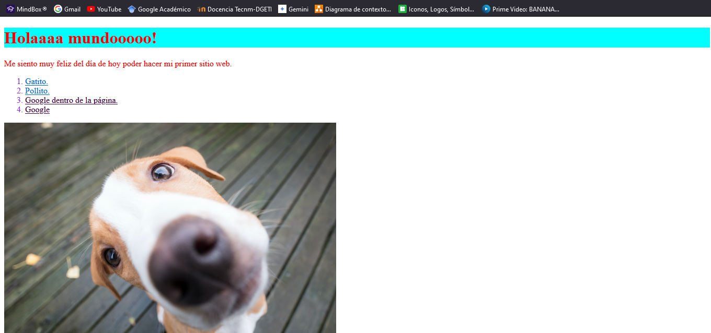
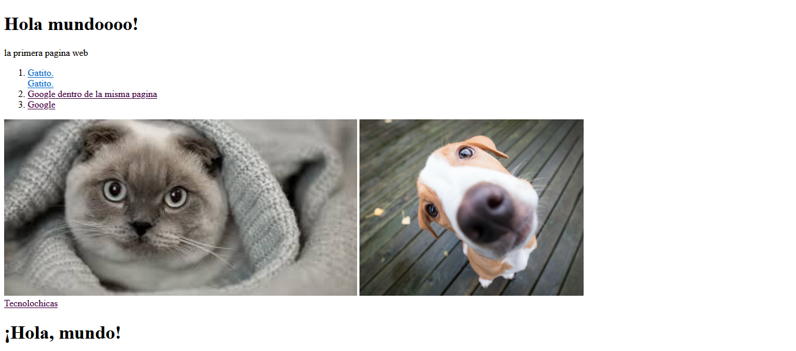
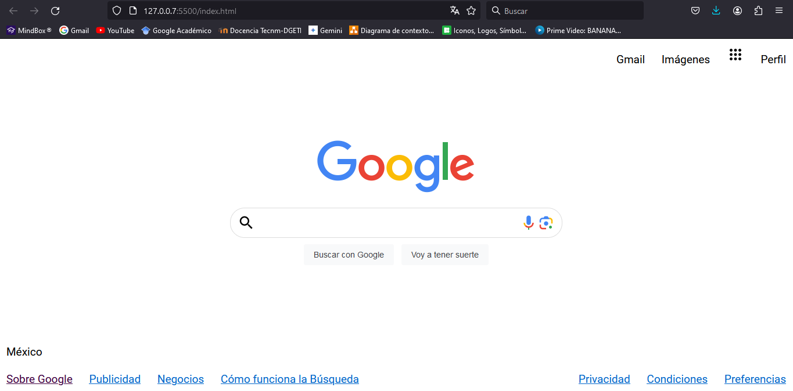

# Mi portafolio de Tecnolochicas PRO

Este portafolio es desarrollado para poner en práctica las habilidades obtenidas dentro del bootcamp de desarrollo frontend.

Fue desarrollado con HTML, CSS y JS con el uso de framework Bootstrap utilizando animaciones de bibliotecas externas.

[Proyecto en linea](https://main--verdant-torrone-6cb545.netlify.app/)

- Capturas de pantalla

- Tecnologías

* HTML
* CSS
* Javascript
* Bootstrap 5

Ocupamos bibliotecas extra.

Creado por Malinali en el bootcamp de Technolochicas PRO.